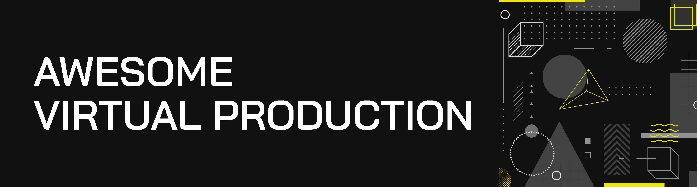

> A curated list of awesome indie virtual production resources using Unreal Engine, inspired by [awesome](https://github.com/sindresorhus/awesome).

#### Please read [`contributing guidelines`](./contributing.md) before submitting new resources.

***

## Table of Contents
- [Overview](#overview)
    - [What is Virtual Production](#overview)
    - [Why Unreal Engine](#overview)
- [Plugins](#plugins)
- [Hardware](#hardware)
    - [Cameras](#cameras)
    - [Capture Cards](#capture-cards)
    - [Tracking Devices](#tracking-devices)
- [Tutorials](#tutorials)
- [Community](#community)
- [Contribution](#contribution)

## Overview
### What is Virtual Production
> Virtual production tends to be used to help visualize complex scenes or scenes that simply cannot be filmed for real. In general, though, virtual production can really refer to any techniques that allow filmmakers to plan, imagine, or complete some kind of filmic element, typically with the aid of digital tools. Previs, techvis, postvis, motion capture, vr, ar, simul-cams, virtual cameras, and real-time rendering – and combinations of these – are all terms now synonymous with virtual production.
>
>[*-Cartoon Brew*](https://www.cartoonbrew.com/vfx/a-virtual-production-explainer-what-it-is-and-what-it-could-mean-for-your-project-166554.html)

### Why Unreal Engine
>#### Immediate feedback, without the wait
>With real-time rendering that enables creatives to receive immediate feedback on their work and make changes on the fly, shot production is no longer a waiting game. In Unreal Engine’s collaborative creative environment, your entire crew can share ideas visually, iterate quickly, and make decisions with confidence.
>#### End-to-end production efficiencies
>From earliest concept to finished frames, Unreal Engine workflows provide the flexibility to reuse the same set of optimized assets through every phase of production, eliminating time-consuming and costly rework. You can even use the same assets for interactive and location-based entertainment, marketing materials, and more.
>#### And it's completely free
>[*-Unreal Engine*](https://www.unrealengine.com/en-US/industry/film-television)

    <b><a href="#table-of-contents">↥ Back To Top</a></b>

## Hardware

### Capture Cards
#### Recomended Capture Cards (by Epic Games)
##### Blackmagic
- [DeckLink 4K Extreme 12G](https://www.blackmagicdesign.com/products/decklink/techspecs/W-DLK-25)
- [DeckLink Duo 2](https://www.blackmagicdesign.com/products/decklink/techspecs/W-DLK-31)
- [DeckLink 8K Pro](https://www.blackmagicdesign.com/products/decklink/techspecs/W-DLK-34)

##### AJA
- [Corvid 44 12G](https://www.aja.com/products/corvid-44-12g)
- [Corvid 44](https://www.aja.com/products/corvid-44)
- [KONA 4](https://www.aja.com/products/kona-4) - 4K bitfile is supported, UFC bitfile is not supported.
- [KONA 5](https://www.aja.com/products/kona-5) - Both KONA 5 (4K) and KONA 5 (8K) bitfiles are supported.
- [KONA HDMI](https://www.aja.com/products/kona-hdmi)
- [Io 4K Plus](https://www.aja.com/products/io-4k-plus)

#### Tested Capture Cards (by Community)
>Need your contribution.
##### Blackmagic
- [DeckLink Studio 4K](https://www.blackmagicdesign.com/products/decklink/techspecs/W-DLK-12)
- [DeckLink Mini Recorder](https://www.blackmagicdesign.com/products/decklink/techspecs/W-DLK-06) - Input Only.

### Tracking Devices
##### HTC
- [HTC Vive Controller](https://www.vive.com/eu/accessory/controller2018/)
- [SteamVR Base Station 2.0](https://www.vive.com/eu/accessory/base-station2/)
- [HTC Vive Tracker](https://www.vive.com/eu/vive-tracker/)

    <b><a href="#table-of-contents">↥ Back To Top</a></b>

## Tools

### Commercial
- [Vanishing Point](http://vanishingpoint.xyz/) - A combination of hardware and custom software that allows you to use real-time virtual production tools right away.
- [DragonFly](https://glassboxtech.com/products/dragonfly) - A professional cross-platform virtual camera for Unreal Engine, Unity 3D and Maya.

- [Live Client](https://glassboxtech.com/products/live-client) - A facial motion capture software to animate and track facial movement from any video source to CG characters.

- [BeeHive](https://glassboxtech.com/products/beehive) - A collaborative, virtual scene syncing, editing and review solution.

    <b><a href="#table-of-contents">↥ Back To Top</a></b>

## Tutorials
### Unreal Documentation
- [Real-Time Compositing with Composure](https://docs.unrealengine.com/en-US/Engine/Composure/index.html)
- [AJA Video I/O Quick Start](https://docs.unrealengine.com/en-US/Engine/ProVideoIO/AJAQuickStart/index.html)
- [Blackmagic Video I/O Quick Start](https://docs.unrealengine.com/en-US/Engine/ProVideoIO/BlackmagicQuickStart/index.html)
- [Timecode and Genlock](https://docs.unrealengine.com/en-US/Engine/ProVideoIO/TimecodeGenlock/index.html)

### YouTube
- [Cinematography Database](https://www.youtube.com/user/cinematographydb)
- [Richard Frantzén](https://www.youtube.com/channel/UCX7wgObMBx4dgTblpVpGDeA)
- [WINBUSH](https://www.youtube.com/user/JonathanWinbush)
- [Greg Corson](https://www.youtube.com/user/GregCorson)
- [Andy Blondin](https://www.youtube.com/channel/UCa1s9Zc1YxGUTlENQ0Nmyrg)
- [Fatty Bull](https://www.youtube.com/channel/UCQE3ES2xpFa9Ym3mP4XvWww)
- [Unreal Engine](https://www.youtube.com/channel/UCBobmJyzsJ6Ll7UbfhI4iwQ)
    - [Virtual Production in 4.22](https://www.youtube.com/watch?v=y7DwhY5LpBw&t=2704s) - Live Training Session.

    <b><a href="#table-of-contents">↥ Back To Top</a></b>

## Community

- [Facebook - Unreal Engine: Virtual Production](https://www.facebook.com/groups/virtualproduction/)
- [Unreal Forum - Visual Disruptors](https://ue.unrealengine.com/Visual-Disruptors.html)
- [Discord - Virtual Production with Unreal Engine](https://discord.com/invite/GJQFYdh)

    <b><a href="#table-of-contents">↥ Back To Top</a></b>

## 🙌 Contribution

> Have a look at [contribution docs](./CONTRIBUTING.md) for how to update any of the resources.

- Open pull request with improvements
- Discuss ideas in issues
- Spread the word
- Reach out with any feedback 

## License

This repo is licensed under the [MIT License](./LICENSE).
